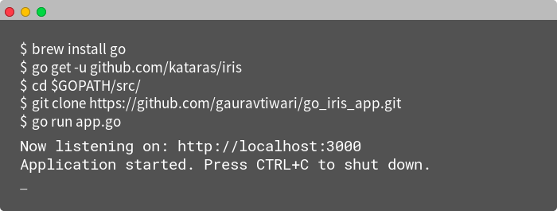

# A basic web app built in Iris web framework for Go



## Getting started

1. Install Go (Golang)
    * Using [Brew](https://brew.sh/).
    * Or by navigating to https://golang.org/dl.
2. Download & Install [Iris](https://iris-go.com) using go get: `go get -u github.com/kataras/iris`

```bash
$ brew install go
$ go get -u github.com/kataras/iris
$ cd $GOPATH/src/
$ git clone https://github.com/iris-contrib/go_iris_app.git
$ go run app.go
```

